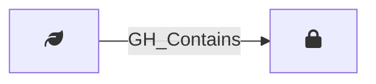

## Description

Represents an environment-level GitHub Actions secret. These secrets are scoped to a specific deployment environment and are only available to workflow jobs that reference that environment.

## Edges

### Inbound Edges

| Start | End | Kind | Description |
|-------|-----|------|-------------|
| [GH_Environment](/opengraph/extensions/githound/reference/nodes/gh_environment) | [GH_EnvironmentSecret](/opengraph/extensions/githound/reference/nodes/gh_environmentsecret) | [GH_Contains](/opengraph/extensions/githound/reference/edges/gh_contains) | Environment contains secret |

### Outbound Edges

No outgoing edges.

## Properties

::: openfetch_github.models.env_secret.GHEnvironmentSecretProperties
    options:
      show_docstring_attributes: true
      inherited_members: true
      members_order: source
