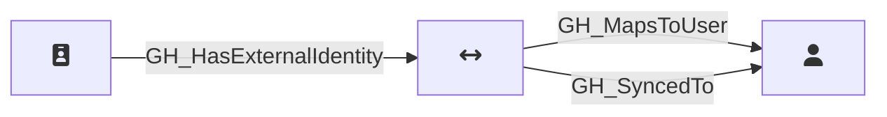

## Description

Represents an external identity from a SAML or SCIM identity provider that is linked to a GitHub user. External identities map corporate user accounts (from providers like Okta, Azure AD, etc.) to GitHub user accounts, enabling single sign-on authentication. Each external identity can have both SAML and SCIM identity attributes.

## Edges

<Note>
The tables below list edges defined by the GitHound extension only. Additional edges to or from this node may be created by other extensions.
</Note>

### Inbound Edges

| Start | End | Kind | Description |
|-------|-----|------|-------------|
| [GH_SamlIdentityProvider](/opengraph/extensions/githound/reference/nodes/gh_samlidentityprovider) | GH_ExternalIdentity | [GH_HasExternalIdentity](/opengraph/extensions/githound/reference/edges/gh_hasexternalidentity) | IdP has external identity |

### Outbound Edges

| Start | End | Kind | Description |
|-------|-----|------|-------------|
| GH_ExternalIdentity | [GH_User](/opengraph/extensions/githound/reference/nodes/gh_user) | [GH_MapsToUser](/opengraph/extensions/githound/reference/edges/gh_mapstouser) | External identity maps to a user |
| GH_ExternalIdentity | [GH_User](/opengraph/extensions/githound/reference/nodes/gh_user) | [GH_SyncedTo](/opengraph/extensions/githound/reference/edges/gh_syncedto) | Foreign IdP user is synced to a GitHub user |

## Properties

::: openfetch_github.models.external_identity.GHExternalIdentityProperties
    options:
      show_docstring_attributes: true
      inherited_members: true
      members_order: source
