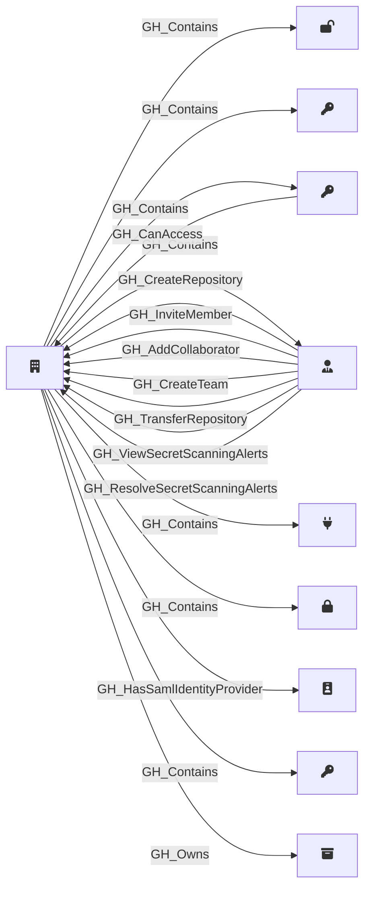

## Description

Represents a GitHub organization. This is the root node of the graph and serves as the primary container for all other nodes. Organization-level settings such as default repository permissions, Actions configuration, and security features are captured as properties on this node.

## Edges

### Inbound Edges

| Start | End | Kind | Description |
|-------|-----|------|-------------|
| [GH_PersonalAccessToken](/opengraph/extensions/githound/reference/nodes/gh_personalaccesstoken) | [GH_Organization](/opengraph/extensions/githound/reference/nodes/gh_organization) | [GH_CanAccess](/opengraph/extensions/githound/reference/edges/gh_canaccess) | PAT can access org |
| [GH_OrgRole](/opengraph/extensions/githound/reference/nodes/gh_orgrole) | [GH_Organization](/opengraph/extensions/githound/reference/nodes/gh_organization) | [GH_CreateRepository](/opengraph/extensions/githound/reference/edges/gh_createrepository) | Role can create repositories in the organization |
| [GH_OrgRole](/opengraph/extensions/githound/reference/nodes/gh_orgrole) | [GH_Organization](/opengraph/extensions/githound/reference/nodes/gh_organization) | [GH_InviteMember](/opengraph/extensions/githound/reference/edges/gh_invitemember) | Role can invite members to the organization |
| [GH_OrgRole](/opengraph/extensions/githound/reference/nodes/gh_orgrole) | [GH_Organization](/opengraph/extensions/githound/reference/nodes/gh_organization) | [GH_AddCollaborator](/opengraph/extensions/githound/reference/edges/gh_addcollaborator) | Role can add outside collaborators to repositories |
| [GH_OrgRole](/opengraph/extensions/githound/reference/nodes/gh_orgrole) | [GH_Organization](/opengraph/extensions/githound/reference/nodes/gh_organization) | [GH_CreateTeam](/opengraph/extensions/githound/reference/edges/gh_createteam) | Role can create teams in the organization |
| [GH_OrgRole](/opengraph/extensions/githound/reference/nodes/gh_orgrole) | [GH_Organization](/opengraph/extensions/githound/reference/nodes/gh_organization) | [GH_TransferRepository](/opengraph/extensions/githound/reference/edges/gh_transferrepository) | Role can transfer repositories out of the organization |
| [GH_OrgRole](/opengraph/extensions/githound/reference/nodes/gh_orgrole) | [GH_Organization](/opengraph/extensions/githound/reference/nodes/gh_organization) | [GH_ViewSecretScanningAlerts](/opengraph/extensions/githound/reference/edges/gh_viewsecretscanningalerts) | Role can view secret scanning alerts for the organization |
| [GH_OrgRole](/opengraph/extensions/githound/reference/nodes/gh_orgrole) | [GH_Organization](/opengraph/extensions/githound/reference/nodes/gh_organization) | [GH_ResolveSecretScanningAlerts](/opengraph/extensions/githound/reference/edges/gh_resolvesecretscanningalerts) | Role can resolve secret scanning alerts for the organization |

### Outbound Edges

| Start | End | Kind | Description |
|-------|-----|------|-------------|
| [GH_Organization](/opengraph/extensions/githound/reference/nodes/gh_organization) | [GH_OrgVariable](/opengraph/extensions/githound/reference/nodes/gh_orgvariable) | [GH_Contains](/opengraph/extensions/githound/reference/edges/gh_contains) | Org contains variable |
| [GH_Organization](/opengraph/extensions/githound/reference/nodes/gh_organization) | [GH_SecretScanningAlert](/opengraph/extensions/githound/reference/nodes/gh_secretscanningalert) | [GH_Contains](/opengraph/extensions/githound/reference/edges/gh_contains) | Org contains secret scanning alert |
| [GH_Organization](/opengraph/extensions/githound/reference/nodes/gh_organization) | [GH_PersonalAccessToken](/opengraph/extensions/githound/reference/nodes/gh_personalaccesstoken) | [GH_Contains](/opengraph/extensions/githound/reference/edges/gh_contains) | Org contains PAT |
| [GH_Organization](/opengraph/extensions/githound/reference/nodes/gh_organization) | [GH_OrgRole](/opengraph/extensions/githound/reference/nodes/gh_orgrole) | [GH_Contains](/opengraph/extensions/githound/reference/edges/gh_contains) | Org contains role |
| [GH_Organization](/opengraph/extensions/githound/reference/nodes/gh_organization) | [GH_AppInstallation](/opengraph/extensions/githound/reference/nodes/gh_appinstallation) | [GH_Contains](/opengraph/extensions/githound/reference/edges/gh_contains) | Org contains app installation |
| [GH_Organization](/opengraph/extensions/githound/reference/nodes/gh_organization) | [GH_OrgSecret](/opengraph/extensions/githound/reference/nodes/gh_orgsecret) | [GH_Contains](/opengraph/extensions/githound/reference/edges/gh_contains) | Org contains secret |
| [GH_Organization](/opengraph/extensions/githound/reference/nodes/gh_organization) | [GH_SamlIdentityProvider](/opengraph/extensions/githound/reference/nodes/gh_samlidentityprovider) | [GH_HasSamlIdentityProvider](/opengraph/extensions/githound/reference/edges/gh_hassamlidentityprovider) | Org uses this SAML IdP |
| [GH_Organization](/opengraph/extensions/githound/reference/nodes/gh_organization) | [GH_PersonalAccessTokenRequest](/opengraph/extensions/githound/reference/nodes/gh_personalaccesstokenrequest) | [GH_Contains](/opengraph/extensions/githound/reference/edges/gh_contains) | Org contains PAT request |
| [GH_Organization](/opengraph/extensions/githound/reference/nodes/gh_organization) | [GH_Repository](/opengraph/extensions/githound/reference/nodes/gh_repository) | [GH_Owns](/opengraph/extensions/githound/reference/edges/gh_owns) | Org owns repository |

## Properties

::: openfetch_github.models.org.GHOrganizationProperties
    options:
      show_docstring_attributes: true
      inherited_members: true
      members_order: source
