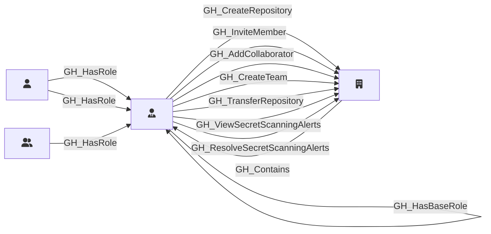

## Description

Represents an organization-level role such as Owner, Member, or a custom organization role. Org roles define what permissions a user or team has at the organization level. The Owner and Member roles are default (built-in), while custom roles inherit from a base role and can have additional permissions.

## Edges

<Note>
The tables below list edges defined by the GitHound extension only. Additional edges to or from this node may be created by other extensions.
</Note>

### Inbound Edges

| Start | End | Kind | Description |
|-------|-----|------|-------------|
| [GH_User](/opengraph/extensions/githound/reference/nodes/gh_user) | GH_OrgRole | [GH_HasRole](/opengraph/extensions/githound/reference/edges/gh_hasrole) | User has default org role (owners or members) |
| [GH_Organization](/opengraph/extensions/githound/reference/nodes/gh_organization) | GH_OrgRole | [GH_Contains](/opengraph/extensions/githound/reference/edges/gh_contains) | Org contains role |
| GH_OrgRole | GH_OrgRole | [GH_HasBaseRole](/opengraph/extensions/githound/reference/edges/gh_hasbaserole) | Role inherits base role |
| [GH_User](/opengraph/extensions/githound/reference/nodes/gh_user) | GH_OrgRole | [GH_HasRole](/opengraph/extensions/githound/reference/edges/gh_hasrole) | User has org role |
| [GH_Team](/opengraph/extensions/githound/reference/nodes/gh_team) | GH_OrgRole | [GH_HasRole](/opengraph/extensions/githound/reference/edges/gh_hasrole) | Team has org role |

### Outbound Edges

| Start | End | Kind | Description |
|-------|-----|------|-------------|
| GH_OrgRole | GH_OrgRole | [GH_HasBaseRole](/opengraph/extensions/githound/reference/edges/gh_hasbaserole) | Role inherits base role |
| GH_OrgRole | [GH_Organization](/opengraph/extensions/githound/reference/nodes/gh_organization) | [GH_CreateRepository](/opengraph/extensions/githound/reference/edges/gh_createrepository) | Role can create repositories in the organization |
| GH_OrgRole | [GH_Organization](/opengraph/extensions/githound/reference/nodes/gh_organization) | [GH_InviteMember](/opengraph/extensions/githound/reference/edges/gh_invitemember) | Role can invite members to the organization |
| GH_OrgRole | [GH_Organization](/opengraph/extensions/githound/reference/nodes/gh_organization) | [GH_AddCollaborator](/opengraph/extensions/githound/reference/edges/gh_addcollaborator) | Role can add outside collaborators to repositories |
| GH_OrgRole | [GH_Organization](/opengraph/extensions/githound/reference/nodes/gh_organization) | [GH_CreateTeam](/opengraph/extensions/githound/reference/edges/gh_createteam) | Role can create teams in the organization |
| GH_OrgRole | [GH_Organization](/opengraph/extensions/githound/reference/nodes/gh_organization) | [GH_TransferRepository](/opengraph/extensions/githound/reference/edges/gh_transferrepository) | Role can transfer repositories out of the organization |
| GH_OrgRole | [GH_Organization](/opengraph/extensions/githound/reference/nodes/gh_organization) | [GH_ViewSecretScanningAlerts](/opengraph/extensions/githound/reference/edges/gh_viewsecretscanningalerts) | Role can view secret scanning alerts for the organization |
| GH_OrgRole | [GH_Organization](/opengraph/extensions/githound/reference/nodes/gh_organization) | [GH_ResolveSecretScanningAlerts](/opengraph/extensions/githound/reference/edges/gh_resolvesecretscanningalerts) | Role can resolve secret scanning alerts for the organization |

## Properties

::: openfetch_github.models.org_role.GHOrgRoleProperties
    options:
      show_docstring_attributes: true
      inherited_members: true
      members_order: source
