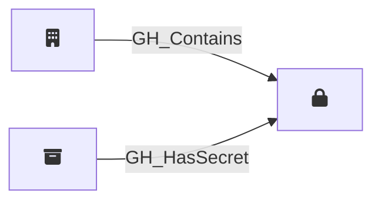

## Description

Represents an organization-level GitHub Actions secret. Organization secrets can be scoped to all repositories, only private/internal repositories, or a specific set of selected repositories. The visibility property determines how [GH_HasSecret](/opengraph/extensions/githound/reference/edges/gh_hassecret) edges are resolved to repository nodes.

## Edges

<Note>
The tables below list edges defined by the GitHound extension only. Additional edges to or from this node may be created by other extensions.
</Note>

### Inbound Edges

| Start | End | Kind | Description |
|-------|-----|------|-------------|
| [GH_Organization](/opengraph/extensions/githound/reference/nodes/gh_organization) | GH_OrgSecret | [GH_Contains](/opengraph/extensions/githound/reference/edges/gh_contains) | Org contains secret |
| [GH_Repository](/opengraph/extensions/githound/reference/nodes/gh_repository) | GH_OrgSecret | [GH_HasSecret](/opengraph/extensions/githound/reference/edges/gh_hassecret) | Repository can access org secret |

### Outbound Edges

No outgoing edges.

## Properties

::: openfetch_github.models.org_secret.GHOrgSecretProperties
    options:
      show_docstring_attributes: true
      inherited_members: true
      members_order: source
