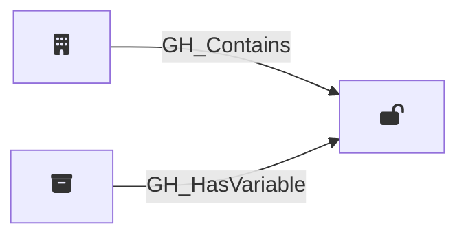

## Description

Represents an organization-level GitHub Actions variable. Organization variables can be scoped to all repositories, only private/internal repositories, or a specific set of selected repositories. The visibility property determines how [GH_HasVariable](/opengraph/extensions/githound/reference/edges/gh_hasvariable) edges are resolved to repository nodes. Unlike secrets, variable values are readable via the API.

## Edges

### Inbound Edges

| Start | End | Kind | Description |
|-------|-----|------|-------------|
| [GH_Organization](/opengraph/extensions/githound/reference/nodes/gh_organization) | [GH_OrgVariable](/opengraph/extensions/githound/reference/nodes/gh_orgvariable) | [GH_Contains](/opengraph/extensions/githound/reference/edges/gh_contains) | Org contains variable |
| [GH_Repository](/opengraph/extensions/githound/reference/nodes/gh_repository) | [GH_OrgVariable](/opengraph/extensions/githound/reference/nodes/gh_orgvariable) | [GH_HasVariable](/opengraph/extensions/githound/reference/edges/gh_hasvariable) | Repository can access org variable |

### Outbound Edges

No outgoing edges.

## Properties

::: openfetch_github.models.org_variable.GHOrgVariableProperties
    options:
      show_docstring_attributes: true
      inherited_members: true
      members_order: source
