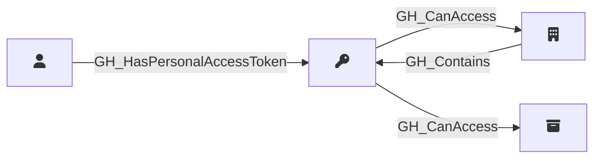

## Description

Represents a fine-grained personal access token that has been granted access to organization resources. PATs are linked to their owning user, the organization, and the repositories they can access. The permissions granted to the token are captured as a JSON string in the properties.

## Edges

### Inbound Edges

| Start | End | Kind | Description |
|-------|-----|------|-------------|
| [GH_User](/opengraph/extensions/githound/reference/nodes/gh_user) | [GH_PersonalAccessToken](/opengraph/extensions/githound/reference/nodes/gh_personalaccesstoken) | [GH_HasPersonalAccessToken](/opengraph/extensions/githound/reference/edges/gh_haspersonalaccesstoken) | User owns PAT |
| [GH_Organization](/opengraph/extensions/githound/reference/nodes/gh_organization) | [GH_PersonalAccessToken](/opengraph/extensions/githound/reference/nodes/gh_personalaccesstoken) | [GH_Contains](/opengraph/extensions/githound/reference/edges/gh_contains) | Org contains PAT |

### Outbound Edges

| Start | End | Kind | Description |
|-------|-----|------|-------------|
| [GH_PersonalAccessToken](/opengraph/extensions/githound/reference/nodes/gh_personalaccesstoken) | [GH_Organization](/opengraph/extensions/githound/reference/nodes/gh_organization) | [GH_CanAccess](/opengraph/extensions/githound/reference/edges/gh_canaccess) | PAT can access org |
| [GH_PersonalAccessToken](/opengraph/extensions/githound/reference/nodes/gh_personalaccesstoken) | [GH_Repository](/opengraph/extensions/githound/reference/nodes/gh_repository) | [GH_CanAccess](/opengraph/extensions/githound/reference/edges/gh_canaccess) | PAT can access repository |

## Properties

::: openfetch_github.models.personal_access_token.GHPersonalAccessTokenProperties
    options:
      show_docstring_attributes: true
      inherited_members: true
      members_order: source
