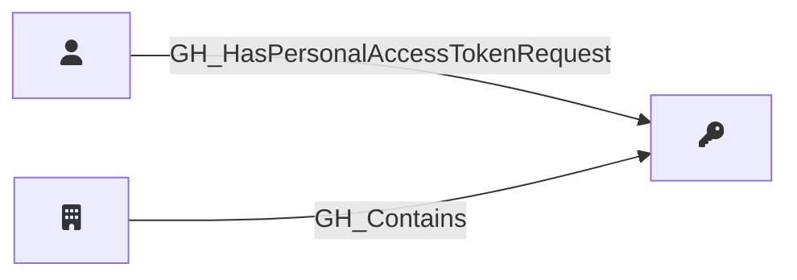

## Description

Represents a pending request from an organization member to access organization resources with a fine-grained personal access token. PAT requests are linked to their owning user and the organization. The requested permissions are captured as a JSON string in the properties.

## Edges

<Note>
The tables below list edges defined by the GitHound extension only. Additional edges to or from this node may be created by other extensions.
</Note>

### Inbound Edges

| Start | End | Kind | Description |
|-------|-----|------|-------------|
| [GH_User](/opengraph/extensions/githound/reference/nodes/gh_user) | GH_PersonalAccessTokenRequest | [GH_HasPersonalAccessTokenRequest](/opengraph/extensions/githound/reference/edges/gh_haspersonalaccesstokenrequest) | User submitted PAT request |
| [GH_Organization](/opengraph/extensions/githound/reference/nodes/gh_organization) | GH_PersonalAccessTokenRequest | [GH_Contains](/opengraph/extensions/githound/reference/edges/gh_contains) | Org contains PAT request |

### Outbound Edges

No outgoing edges.

## Properties

::: openfetch_github.models.personal_access_token_request.GHPersonalAccessTokenRequestProperties
    options:
      show_docstring_attributes: true
      inherited_members: true
      members_order: source
