## Description

Represents a repository-level permission role. Each repository has five default roles (Read, Write, Admin, Triage, Maintain) plus any custom repository roles defined at the organization level. Repo roles define what actions a user or team can perform on a specific repository. Default roles form an inheritance hierarchy (Triage -> Read, Maintain -> Write, Admin includes all), and custom roles inherit from one of the base roles.

## Edges

<Note>
The tables below list edges defined by the GitHound extension only. Additional edges to or from this node may be created by other extensions.

```mermaid
flowchart LR

    GH_RepoRole["fa:fa-user-tie"]:::bhNode
    GH_Repository["fa:fa-box-archive"]:::bhNode
    GH_Branch["fa:fa-code-branch"]:::bhNode
    GH_User["fa:fa-user"]:::bhNode
    GH_Team["fa:fa-user-group"]:::bhNode
    GH_RepoRole -- GH_ReadRepoContents --> GH_Repository
    GH_RepoRole -- GH_WriteRepoContents --> GH_Repository
    GH_RepoRole -- GH_WriteRepoPullRequests --> GH_Repository
    GH_RepoRole -- GH_AdminTo --> GH_Repository
    GH_RepoRole -- GH_HasBaseRole --> GH_RepoRole
    GH_RepoRole -- GH_BypassBranchProtection --> GH_Repository
    GH_RepoRole -- GH_PushProtectedBranch --> GH_Repository
    GH_RepoRole -- GH_EditRepoProtections --> GH_Repository
    GH_RepoRole -- GH_ViewSecretScanningAlerts --> GH_Repository
    GH_RepoRole -- GH_ResolveSecretScanningAlerts --> GH_Repository
    GH_RepoRole -- GH_DeleteAlertsCodeScanning --> GH_Repository
    GH_RepoRole -- GH_RunOrgMigration --> GH_Repository
    GH_RepoRole -- GH_ManageSecurityProducts --> GH_Repository
    GH_RepoRole -- GH_ManageRepoSecurityProducts --> GH_Repository
    GH_RepoRole -- GH_ManageWebhooks --> GH_Repository
    GH_RepoRole -- GH_ManageDeployKeys --> GH_Repository
    GH_RepoRole -- GH_CanCreateBranch --> GH_Repository
    GH_RepoRole -- GH_CanWriteBranch --> GH_Branch
    GH_RepoRole -- GH_CanEditProtection --> GH_Branch
    GH_RepoRole -- GH_ReadCodeScanning --> GH_Repository
    GH_RepoRole -- GH_WriteCodeScanning --> GH_Repository
    GH_RepoRole -- GH_ViewDependabotAlerts --> GH_Repository
    GH_RepoRole -- GH_ResolveDependabotAlerts --> GH_Repository
    GH_RepoRole -- GH_ManageTopics --> GH_Repository
    GH_RepoRole -- GH_ManageSettingsWiki --> GH_Repository
    GH_RepoRole -- GH_ManageSettingsProjects --> GH_Repository
    GH_RepoRole -- GH_ManageSettingsMergeTypes --> GH_Repository
    GH_RepoRole -- GH_ManageSettingsPages --> GH_Repository
    GH_RepoRole -- GH_EditRepoMetadata --> GH_Repository
    GH_RepoRole -- GH_SetInteractionLimits --> GH_Repository
    GH_RepoRole -- GH_SetSocialPreview --> GH_Repository
    GH_RepoRole -- GH_EditRepoAnnouncementBanners --> GH_Repository
    GH_RepoRole -- GH_EditRepoCustomPropertiesValues --> GH_Repository
    GH_RepoRole -- GH_CreateTag --> GH_Repository
    GH_RepoRole -- GH_DeleteTag --> GH_Repository
    GH_RepoRole -- GH_JumpMergeQueue --> GH_Repository
    GH_RepoRole -- GH_CreateSoloMergeQueueEntry --> GH_Repository
    GH_RepoRole -- GH_AddLabel --> GH_Repository
    GH_RepoRole -- GH_RemoveLabel --> GH_Repository
    GH_RepoRole -- GH_CloseIssue --> GH_Repository
    GH_RepoRole -- GH_ReopenIssue --> GH_Repository
    GH_RepoRole -- GH_DeleteIssue --> GH_Repository
    GH_RepoRole -- GH_ClosePullRequest --> GH_Repository
    GH_RepoRole -- GH_ReopenPullRequest --> GH_Repository
    GH_RepoRole -- GH_AddAssignee --> GH_Repository
    GH_RepoRole -- GH_RemoveAssignee --> GH_Repository
    GH_RepoRole -- GH_RequestPrReview --> GH_Repository
    GH_RepoRole -- GH_MarkAsDuplicate --> GH_Repository
    GH_RepoRole -- GH_SetMilestone --> GH_Repository
    GH_RepoRole -- GH_SetIssueType --> GH_Repository
    GH_RepoRole -- GH_DeleteDiscussion --> GH_Repository
    GH_RepoRole -- GH_ToggleDiscussionAnswer --> GH_Repository
    GH_RepoRole -- GH_ToggleDiscussionCommentMinimize --> GH_Repository
    GH_RepoRole -- GH_CreateDiscussionCategory --> GH_Repository
    GH_RepoRole -- GH_EditDiscussionCategory --> GH_Repository
    GH_RepoRole -- GH_ConvertIssuesToDiscussions --> GH_Repository
    GH_RepoRole -- GH_CloseDiscussion --> GH_Repository
    GH_RepoRole -- GH_ReopenDiscussion --> GH_Repository
    GH_RepoRole -- GH_EditCategoryOnDiscussion --> GH_Repository
    GH_RepoRole -- GH_ManageDiscussionBadges --> GH_Repository
    GH_RepoRole -- GH_EditDiscussionComment --> GH_Repository
    GH_RepoRole -- GH_DeleteDiscussionComment --> GH_Repository
    GH_RepoRole -- GH_HasBaseRole --> GH_RepoRole
    GH_User -- GH_HasRole --> GH_RepoRole
    GH_Team -- GH_HasRole --> GH_RepoRole
```

</Note>

### Inbound Edges

| Start | End | Kind | Description |
|-------|-----|------|-------------|
| GH_RepoRole | GH_RepoRole | [GH_HasBaseRole](/opengraph/extensions/githound/reference/edges/gh_hasbaserole) | Role inherits from base role |
| [GH_User](/opengraph/extensions/githound/reference/nodes/gh_user) | GH_RepoRole | [GH_HasRole](/opengraph/extensions/githound/reference/edges/gh_hasrole) | User has repo role |
| [GH_Team](/opengraph/extensions/githound/reference/nodes/gh_team) | GH_RepoRole | [GH_HasRole](/opengraph/extensions/githound/reference/edges/gh_hasrole) | Team has repo role |

### Outbound Edges

| Start | End | Kind | Description |
|-------|-----|------|-------------|
| GH_RepoRole | [GH_Repository](/opengraph/extensions/githound/reference/nodes/gh_repository) | [GH_ReadRepoContents](/opengraph/extensions/githound/reference/edges/gh_readrepocontents) | Role can read repo contents |
| GH_RepoRole | [GH_Repository](/opengraph/extensions/githound/reference/nodes/gh_repository) | [GH_WriteRepoContents](/opengraph/extensions/githound/reference/edges/gh_writerepocontents) | Role can write repo contents |
| GH_RepoRole | [GH_Repository](/opengraph/extensions/githound/reference/nodes/gh_repository) | [GH_WriteRepoPullRequests](/opengraph/extensions/githound/reference/edges/gh_writerepopullrequests) | Role can write pull requests |
| GH_RepoRole | [GH_Repository](/opengraph/extensions/githound/reference/nodes/gh_repository) | [GH_AdminTo](/opengraph/extensions/githound/reference/edges/gh_adminto) | Role has admin access to repo |
| GH_RepoRole | GH_RepoRole | [GH_HasBaseRole](/opengraph/extensions/githound/reference/edges/gh_hasbaserole) | Role inherits from base role |
| GH_RepoRole | [GH_Repository](/opengraph/extensions/githound/reference/nodes/gh_repository) | [GH_BypassBranchProtection](/opengraph/extensions/githound/reference/edges/gh_bypassbranchprotection) | Role can bypass branch protection rules |
| GH_RepoRole | [GH_Repository](/opengraph/extensions/githound/reference/nodes/gh_repository) | [GH_PushProtectedBranch](/opengraph/extensions/githound/reference/edges/gh_pushprotectedbranch) | Role can push to protected branches |
| GH_RepoRole | [GH_Repository](/opengraph/extensions/githound/reference/nodes/gh_repository) | [GH_EditRepoProtections](/opengraph/extensions/githound/reference/edges/gh_editrepoprotections) | Role can edit repository branch protection settings |
| GH_RepoRole | [GH_Repository](/opengraph/extensions/githound/reference/nodes/gh_repository) | [GH_ViewSecretScanningAlerts](/opengraph/extensions/githound/reference/edges/gh_viewsecretscanningalerts) | Role can view secret scanning alerts |
| GH_RepoRole | [GH_Repository](/opengraph/extensions/githound/reference/nodes/gh_repository) | [GH_ResolveSecretScanningAlerts](/opengraph/extensions/githound/reference/edges/gh_resolvesecretscanningalerts) | Role can resolve secret scanning alerts |
| GH_RepoRole | [GH_Repository](/opengraph/extensions/githound/reference/nodes/gh_repository) | [GH_DeleteAlertsCodeScanning](/opengraph/extensions/githound/reference/edges/gh_deletealertscodescanning) | Role can delete code scanning alerts |
| GH_RepoRole | [GH_Repository](/opengraph/extensions/githound/reference/nodes/gh_repository) | [GH_RunOrgMigration](/opengraph/extensions/githound/reference/edges/gh_runorgmigration) | Role can run organization migrations on the repository |
| GH_RepoRole | [GH_Repository](/opengraph/extensions/githound/reference/nodes/gh_repository) | [GH_ManageSecurityProducts](/opengraph/extensions/githound/reference/edges/gh_managesecurityproducts) | Role can manage security products for the repository |
| GH_RepoRole | [GH_Repository](/opengraph/extensions/githound/reference/nodes/gh_repository) | [GH_ManageRepoSecurityProducts](/opengraph/extensions/githound/reference/edges/gh_managereposecurityproducts) | Role can manage repository-level security products |
| GH_RepoRole | [GH_Repository](/opengraph/extensions/githound/reference/nodes/gh_repository) | [GH_ManageWebhooks](/opengraph/extensions/githound/reference/edges/gh_managewebhooks) | Role can manage repository webhooks |
| GH_RepoRole | [GH_Repository](/opengraph/extensions/githound/reference/nodes/gh_repository) | [GH_ManageDeployKeys](/opengraph/extensions/githound/reference/edges/gh_managedeploykeys) | Role can manage repository deploy keys |
| GH_RepoRole | [GH_Repository](/opengraph/extensions/githound/reference/nodes/gh_repository) | [GH_CanCreateBranch](/opengraph/extensions/githound/reference/edges/gh_cancreatebranch) | Role can create new branches in the repository |
| GH_RepoRole | [GH_Branch](/opengraph/extensions/githound/reference/nodes/gh_branch) | [GH_CanWriteBranch](/opengraph/extensions/githound/reference/edges/gh_canwritebranch) | Role can push commits to this branch |
| GH_RepoRole | [GH_Branch](/opengraph/extensions/githound/reference/nodes/gh_branch) | [GH_CanEditProtection](/opengraph/extensions/githound/reference/edges/gh_caneditprotection) | Role can modify or remove the branch protection rule governing this branch |
| GH_RepoRole | [GH_Repository](/opengraph/extensions/githound/reference/nodes/gh_repository) | [GH_ReadCodeScanning](/opengraph/extensions/githound/reference/edges/gh_readcodescanning) | Role can read code scanning results |
| GH_RepoRole | [GH_Repository](/opengraph/extensions/githound/reference/nodes/gh_repository) | [GH_WriteCodeScanning](/opengraph/extensions/githound/reference/edges/gh_writecodescanning) | Role can write code scanning results |
| GH_RepoRole | [GH_Repository](/opengraph/extensions/githound/reference/nodes/gh_repository) | [GH_ViewDependabotAlerts](/opengraph/extensions/githound/reference/edges/gh_viewdependabotalerts) | Role can view Dependabot alerts |
| GH_RepoRole | [GH_Repository](/opengraph/extensions/githound/reference/nodes/gh_repository) | [GH_ResolveDependabotAlerts](/opengraph/extensions/githound/reference/edges/gh_resolvedependabotalerts) | Role can resolve Dependabot alerts |
| GH_RepoRole | [GH_Repository](/opengraph/extensions/githound/reference/nodes/gh_repository) | [GH_ManageTopics](/opengraph/extensions/githound/reference/edges/gh_managetopics) | Role can manage repository topics |
| GH_RepoRole | [GH_Repository](/opengraph/extensions/githound/reference/nodes/gh_repository) | [GH_ManageSettingsWiki](/opengraph/extensions/githound/reference/edges/gh_managesettingswiki) | Role can manage wiki settings |
| GH_RepoRole | [GH_Repository](/opengraph/extensions/githound/reference/nodes/gh_repository) | [GH_ManageSettingsProjects](/opengraph/extensions/githound/reference/edges/gh_managesettingsprojects) | Role can manage projects settings |
| GH_RepoRole | [GH_Repository](/opengraph/extensions/githound/reference/nodes/gh_repository) | [GH_ManageSettingsMergeTypes](/opengraph/extensions/githound/reference/edges/gh_managesettingsmergetypes) | Role can manage merge type settings |
| GH_RepoRole | [GH_Repository](/opengraph/extensions/githound/reference/nodes/gh_repository) | [GH_ManageSettingsPages](/opengraph/extensions/githound/reference/edges/gh_managesettingspages) | Role can manage GitHub Pages settings |
| GH_RepoRole | [GH_Repository](/opengraph/extensions/githound/reference/nodes/gh_repository) | [GH_EditRepoMetadata](/opengraph/extensions/githound/reference/edges/gh_editrepometadata) | Role can edit repository metadata (name, description, etc.) |
| GH_RepoRole | [GH_Repository](/opengraph/extensions/githound/reference/nodes/gh_repository) | [GH_SetInteractionLimits](/opengraph/extensions/githound/reference/edges/gh_setinteractionlimits) | Role can set interaction limits on the repository |
| GH_RepoRole | [GH_Repository](/opengraph/extensions/githound/reference/nodes/gh_repository) | [GH_SetSocialPreview](/opengraph/extensions/githound/reference/edges/gh_setsocialpreview) | Role can set the repository social preview image |
| GH_RepoRole | [GH_Repository](/opengraph/extensions/githound/reference/nodes/gh_repository) | [GH_EditRepoAnnouncementBanners](/opengraph/extensions/githound/reference/edges/gh_editrepoannouncementbanners) | Role can edit repository announcement banners |
| GH_RepoRole | [GH_Repository](/opengraph/extensions/githound/reference/nodes/gh_repository) | [GH_EditRepoCustomPropertiesValues](/opengraph/extensions/githound/reference/edges/gh_editrepocustompropertiesvalues) | Role can edit custom property values on the repository |
| GH_RepoRole | [GH_Repository](/opengraph/extensions/githound/reference/nodes/gh_repository) | [GH_CreateTag](/opengraph/extensions/githound/reference/edges/gh_createtag) | Role can create tags in the repository |
| GH_RepoRole | [GH_Repository](/opengraph/extensions/githound/reference/nodes/gh_repository) | [GH_DeleteTag](/opengraph/extensions/githound/reference/edges/gh_deletetag) | Role can delete tags in the repository |
| GH_RepoRole | [GH_Repository](/opengraph/extensions/githound/reference/nodes/gh_repository) | [GH_JumpMergeQueue](/opengraph/extensions/githound/reference/edges/gh_jumpmergequeue) | Role can jump the merge queue |
| GH_RepoRole | [GH_Repository](/opengraph/extensions/githound/reference/nodes/gh_repository) | [GH_CreateSoloMergeQueueEntry](/opengraph/extensions/githound/reference/edges/gh_createsolomergequeueentry) | Role can create a solo merge queue entry |
| GH_RepoRole | [GH_Repository](/opengraph/extensions/githound/reference/nodes/gh_repository) | [GH_AddLabel](/opengraph/extensions/githound/reference/edges/gh_addlabel) | Role can add labels to issues and pull requests |
| GH_RepoRole | [GH_Repository](/opengraph/extensions/githound/reference/nodes/gh_repository) | [GH_RemoveLabel](/opengraph/extensions/githound/reference/edges/gh_removelabel) | Role can remove labels from issues and pull requests |
| GH_RepoRole | [GH_Repository](/opengraph/extensions/githound/reference/nodes/gh_repository) | [GH_CloseIssue](/opengraph/extensions/githound/reference/edges/gh_closeissue) | Role can close issues |
| GH_RepoRole | [GH_Repository](/opengraph/extensions/githound/reference/nodes/gh_repository) | [GH_ReopenIssue](/opengraph/extensions/githound/reference/edges/gh_reopenissue) | Role can reopen issues |
| GH_RepoRole | [GH_Repository](/opengraph/extensions/githound/reference/nodes/gh_repository) | [GH_DeleteIssue](/opengraph/extensions/githound/reference/edges/gh_deleteissue) | Role can delete issues |
| GH_RepoRole | [GH_Repository](/opengraph/extensions/githound/reference/nodes/gh_repository) | [GH_ClosePullRequest](/opengraph/extensions/githound/reference/edges/gh_closepullrequest) | Role can close pull requests |
| GH_RepoRole | [GH_Repository](/opengraph/extensions/githound/reference/nodes/gh_repository) | [GH_ReopenPullRequest](/opengraph/extensions/githound/reference/edges/gh_reopenpullrequest) | Role can reopen pull requests |
| GH_RepoRole | [GH_Repository](/opengraph/extensions/githound/reference/nodes/gh_repository) | [GH_AddAssignee](/opengraph/extensions/githound/reference/edges/gh_addassignee) | Role can add assignees to issues and pull requests |
| GH_RepoRole | [GH_Repository](/opengraph/extensions/githound/reference/nodes/gh_repository) | [GH_RemoveAssignee](/opengraph/extensions/githound/reference/edges/gh_removeassignee) | Role can remove assignees from issues and pull requests |
| GH_RepoRole | [GH_Repository](/opengraph/extensions/githound/reference/nodes/gh_repository) | [GH_RequestPrReview](/opengraph/extensions/githound/reference/edges/gh_requestprreview) | Role can request pull request reviews |
| GH_RepoRole | [GH_Repository](/opengraph/extensions/githound/reference/nodes/gh_repository) | [GH_MarkAsDuplicate](/opengraph/extensions/githound/reference/edges/gh_markasduplicate) | Role can mark issues or pull requests as duplicates |
| GH_RepoRole | [GH_Repository](/opengraph/extensions/githound/reference/nodes/gh_repository) | [GH_SetMilestone](/opengraph/extensions/githound/reference/edges/gh_setmilestone) | Role can set milestones on issues and pull requests |
| GH_RepoRole | [GH_Repository](/opengraph/extensions/githound/reference/nodes/gh_repository) | [GH_SetIssueType](/opengraph/extensions/githound/reference/edges/gh_setissuetype) | Role can set issue types |
| GH_RepoRole | [GH_Repository](/opengraph/extensions/githound/reference/nodes/gh_repository) | [GH_DeleteDiscussion](/opengraph/extensions/githound/reference/edges/gh_deletediscussion) | Role can delete discussions |
| GH_RepoRole | [GH_Repository](/opengraph/extensions/githound/reference/nodes/gh_repository) | [GH_ToggleDiscussionAnswer](/opengraph/extensions/githound/reference/edges/gh_togglediscussionanswer) | Role can toggle the accepted answer on a discussion |
| GH_RepoRole | [GH_Repository](/opengraph/extensions/githound/reference/nodes/gh_repository) | [GH_ToggleDiscussionCommentMinimize](/opengraph/extensions/githound/reference/edges/gh_togglediscussioncommentminimize) | Role can minimize or un-minimize discussion comments |
| GH_RepoRole | [GH_Repository](/opengraph/extensions/githound/reference/nodes/gh_repository) | [GH_CreateDiscussionCategory](/opengraph/extensions/githound/reference/edges/gh_creatediscussioncategory) | Role can create discussion categories |
| GH_RepoRole | [GH_Repository](/opengraph/extensions/githound/reference/nodes/gh_repository) | [GH_EditDiscussionCategory](/opengraph/extensions/githound/reference/edges/gh_editdiscussioncategory) | Role can edit discussion categories |
| GH_RepoRole | [GH_Repository](/opengraph/extensions/githound/reference/nodes/gh_repository) | [GH_ConvertIssuesToDiscussions](/opengraph/extensions/githound/reference/edges/gh_convertissuestodiscussions) | Role can convert issues to discussions |
| GH_RepoRole | [GH_Repository](/opengraph/extensions/githound/reference/nodes/gh_repository) | [GH_CloseDiscussion](/opengraph/extensions/githound/reference/edges/gh_closediscussion) | Role can close discussions |
| GH_RepoRole | [GH_Repository](/opengraph/extensions/githound/reference/nodes/gh_repository) | [GH_ReopenDiscussion](/opengraph/extensions/githound/reference/edges/gh_reopendiscussion) | Role can reopen discussions |
| GH_RepoRole | [GH_Repository](/opengraph/extensions/githound/reference/nodes/gh_repository) | [GH_EditCategoryOnDiscussion](/opengraph/extensions/githound/reference/edges/gh_editcategoryondiscussion) | Role can edit the category on a discussion |
| GH_RepoRole | [GH_Repository](/opengraph/extensions/githound/reference/nodes/gh_repository) | [GH_ManageDiscussionBadges](/opengraph/extensions/githound/reference/edges/gh_managediscussionbadges) | Role can manage discussion badges |
| GH_RepoRole | [GH_Repository](/opengraph/extensions/githound/reference/nodes/gh_repository) | [GH_EditDiscussionComment](/opengraph/extensions/githound/reference/edges/gh_editdiscussioncomment) | Role can edit discussion comments |
| GH_RepoRole | [GH_Repository](/opengraph/extensions/githound/reference/nodes/gh_repository) | [GH_DeleteDiscussionComment](/opengraph/extensions/githound/reference/edges/gh_deletediscussioncomment) | Role can delete discussion comments |

## Properties

::: openfetch_github.models.repository_role.GHRepoRoleProperties
    options:
      show_docstring_attributes: true
      inherited_members: true
      members_order: source
