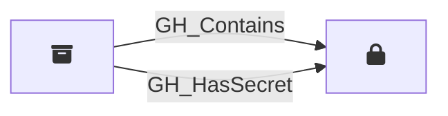

## Description

Represents a repository-level GitHub Actions secret. These are secrets defined directly on a specific repository and are only accessible to workflows running in that repository.

## Edges

### Inbound Edges

| Start | End | Kind | Description |
|-------|-----|------|-------------|
| [GH_Repository](/opengraph/extensions/githound/reference/nodes/gh_repository) | [GH_RepoSecret](/opengraph/extensions/githound/reference/nodes/gh_reposecret) | [GH_Contains](/opengraph/extensions/githound/reference/edges/gh_contains) | Repository contains secret |
| [GH_Repository](/opengraph/extensions/githound/reference/nodes/gh_repository) | [GH_RepoSecret](/opengraph/extensions/githound/reference/nodes/gh_reposecret) | [GH_HasSecret](/opengraph/extensions/githound/reference/edges/gh_hassecret) | Repository has access to secret |

### Outbound Edges

No outgoing edges.

## Properties

::: openfetch_github.models.repository_secret.GHRepoSecretProperties
    options:
      show_docstring_attributes: true
      inherited_members: true
      members_order: source
