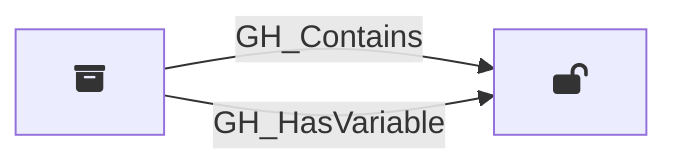

## Description

Represents a repository-level GitHub Actions variable. These are variables defined directly on a specific repository and are only accessible to workflows running in that repository. Unlike secrets, variable values are readable via the API.

## Edges

<Note>
The tables below list edges defined by the GitHound extension only. Additional edges to or from this node may be created by other extensions.
</Note>

### Inbound Edges

| Start | End | Kind | Description |
|-------|-----|------|-------------|
| [GH_Repository](/opengraph/extensions/githound/reference/nodes/gh_repository) | GH_RepoVariable | [GH_Contains](/opengraph/extensions/githound/reference/edges/gh_contains) | Repository contains variable |
| [GH_Repository](/opengraph/extensions/githound/reference/nodes/gh_repository) | GH_RepoVariable | [GH_HasVariable](/opengraph/extensions/githound/reference/edges/gh_hasvariable) | Repository has access to variable |

### Outbound Edges

No outgoing edges.

## Properties

::: openfetch_github.models.repository_variable.GHRepoVariableProperties
    options:
      show_docstring_attributes: true
      inherited_members: true
      members_order: source
