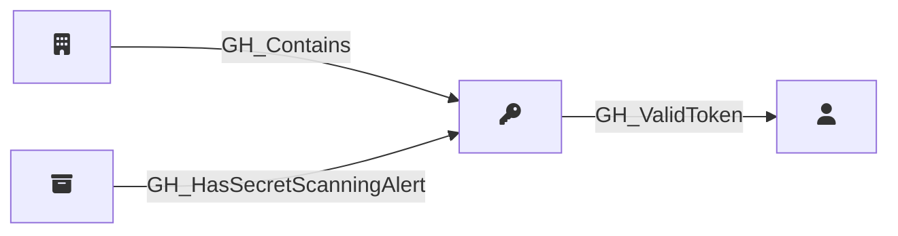

## Description

Represents a GitHub secret scanning alert detected in a repository. Secret scanning alerts are raised when GitHub detects a known secret pattern (such as an API key, token, or credential) committed to a repository. The alert captures the secret type, validity status, and current resolution state.

## Edges

### Inbound Edges

| Start | End | Kind | Description |
|-------|-----|------|-------------|
| [GH_Organization](/opengraph/extensions/githound/reference/nodes/gh_organization) | [GH_SecretScanningAlert](/opengraph/extensions/githound/reference/nodes/gh_secretscanningalert) | [GH_Contains](/opengraph/extensions/githound/reference/edges/gh_contains) | Org contains secret scanning alert |
| [GH_Repository](/opengraph/extensions/githound/reference/nodes/gh_repository) | [GH_SecretScanningAlert](/opengraph/extensions/githound/reference/nodes/gh_secretscanningalert) | [GH_HasSecretScanningAlert](../../graph/edges/gh_hassecretscanningalert) | Repository has secret scanning alert |

### Outbound Edges

| Start | End | Kind | Description |
|-------|-----|------|-------------|
| [GH_SecretScanningAlert](/opengraph/extensions/githound/reference/nodes/gh_secretscanningalert) | [GH_User](/opengraph/extensions/githound/reference/nodes/gh_user) | [GH_ValidToken](/opengraph/extensions/githound/reference/edges/gh_validtoken) | Alert secret is a valid PAT for this user |

## Properties

::: openfetch_github.models.secret_scanning_alert.GHSecretScanningAlertProperties
    options:
      show_docstring_attributes: true
      inherited_members: true
      members_order: source
