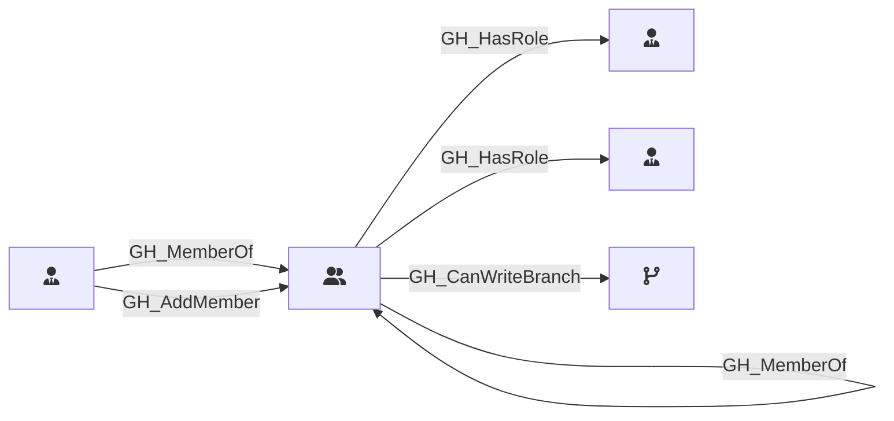

## Description

Represents a GitHub team within the organization. Teams can have parent-child relationships, contain members with different roles (Member, Maintainer), and be assigned to repository roles.

## Edges

### Inbound Edges

| Start | End | Kind | Description |
|-------|-----|------|-------------|
| [GH_Team](/opengraph/extensions/githound/reference/nodes/gh_team) | [GH_Team](/opengraph/extensions/githound/reference/nodes/gh_team) | [GH_MemberOf](/opengraph/extensions/githound/reference/edges/gh_memberof) | Team is a child of parent team |
| [GH_TeamRole](/opengraph/extensions/githound/reference/nodes/gh_teamrole) | [GH_Team](/opengraph/extensions/githound/reference/nodes/gh_team) | [GH_MemberOf](/opengraph/extensions/githound/reference/edges/gh_memberof) | Team role belongs to team |
| [GH_TeamRole](/opengraph/extensions/githound/reference/nodes/gh_teamrole) | [GH_Team](/opengraph/extensions/githound/reference/nodes/gh_team) | [GH_AddMember](/opengraph/extensions/githound/reference/edges/gh_addmember) | Maintainers role can add members to team |

### Outbound Edges

| Start | End | Kind | Description |
|-------|-----|------|-------------|
| [GH_Team](/opengraph/extensions/githound/reference/nodes/gh_team) | [GH_OrgRole](/opengraph/extensions/githound/reference/nodes/gh_orgrole) | [GH_HasRole](/opengraph/extensions/githound/reference/edges/gh_hasrole) | Team has org role |
| [GH_Team](/opengraph/extensions/githound/reference/nodes/gh_team) | [GH_Team](/opengraph/extensions/githound/reference/nodes/gh_team) | [GH_MemberOf](/opengraph/extensions/githound/reference/edges/gh_memberof) | Team is a child of parent team |
| [GH_Team](/opengraph/extensions/githound/reference/nodes/gh_team) | [GH_RepoRole](/opengraph/extensions/githound/reference/nodes/gh_reporole) | [GH_HasRole](/opengraph/extensions/githound/reference/edges/gh_hasrole) | Team has repo role |
| [GH_Team](/opengraph/extensions/githound/reference/nodes/gh_team) | [GH_Branch](/opengraph/extensions/githound/reference/nodes/gh_branch) | [GH_CanWriteBranch](/opengraph/extensions/githound/reference/edges/gh_canwritebranch) | Team can push commits to this branch via actor-level bypass allowances |

## Properties

::: openfetch_github.models.team.GHTeamProperties
    options:
      show_docstring_attributes: true
      inherited_members: true
      members_order: source
