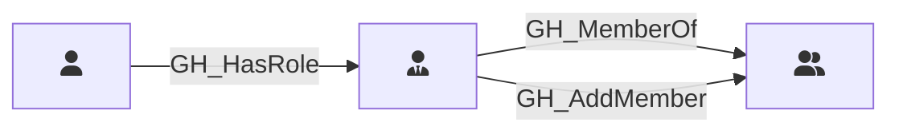

## Description

Represents a role within a GitHub team. Each team has two built-in roles: Member and Maintainer. Maintainers can add and remove team members. Team roles connect users to teams and transitively to any repository roles assigned to the team.

## Edges

<Note>
The tables below list edges defined by the GitHound extension only. Additional edges to or from this node may be created by other extensions.
</Note>

### Inbound Edges

| Start | End | Kind | Description |
|-------|-----|------|-------------|
| [GH_User](/opengraph/extensions/githound/reference/nodes/gh_user) | GH_TeamRole | [GH_HasRole](/opengraph/extensions/githound/reference/edges/gh_hasrole) | User has team role |

### Outbound Edges

| Start | End | Kind | Description |
|-------|-----|------|-------------|
| GH_TeamRole | [GH_Team](/opengraph/extensions/githound/reference/nodes/gh_team) | [GH_MemberOf](/opengraph/extensions/githound/reference/edges/gh_memberof) | Team role belongs to team |
| GH_TeamRole | [GH_Team](/opengraph/extensions/githound/reference/nodes/gh_team) | [GH_AddMember](/opengraph/extensions/githound/reference/edges/gh_addmember) | Maintainers role can add members to team |

## Properties

::: openfetch_github.models.team_role.GHTeamRoleProperties
    options:
      show_docstring_attributes: true
      inherited_members: true
      members_order: source
