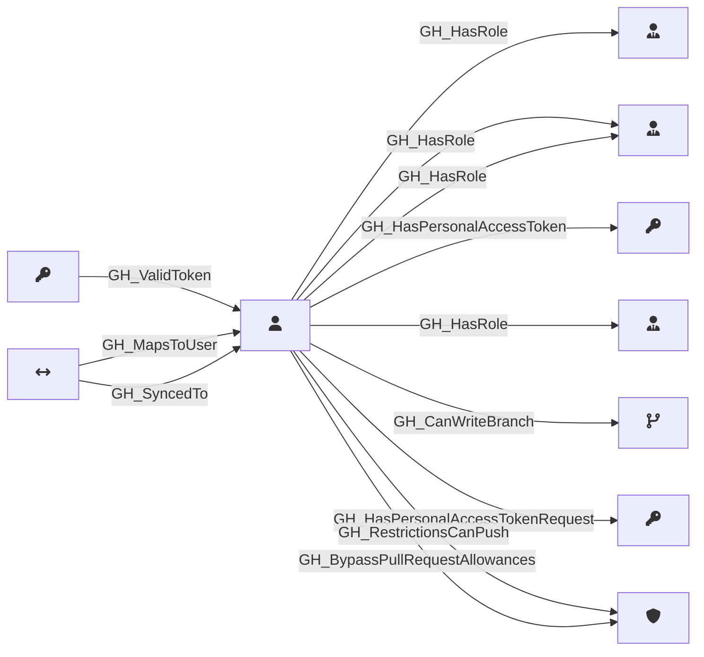

## Description

Represents a GitHub user who is a member of the organization. Users are associated with organization roles (Owner or Member) and can be assigned to repository roles and team roles.

## Edges

### Inbound Edges

| Start | End | Kind | Description |
|-------|-----|------|-------------|
| [GH_SecretScanningAlert](/opengraph/extensions/githound/reference/nodes/gh_secretscanningalert) | [GH_User](/opengraph/extensions/githound/reference/nodes/gh_user) | [GH_ValidToken](/opengraph/extensions/githound/reference/edges/gh_validtoken) | Alert secret is a valid PAT for this user |
| [GH_ExternalIdentity](/opengraph/extensions/githound/reference/nodes/gh_externalidentity) | [GH_User](/opengraph/extensions/githound/reference/nodes/gh_user) | [GH_MapsToUser](/opengraph/extensions/githound/reference/edges/gh_mapstouser) | External identity maps to a user |
| [GH_ExternalIdentity](/opengraph/extensions/githound/reference/nodes/gh_externalidentity) | [GH_User](/opengraph/extensions/githound/reference/nodes/gh_user) | [GH_SyncedTo](/opengraph/extensions/githound/reference/edges/gh_syncedto) | Foreign IdP user is synced to a GitHub user |

### Outbound Edges

| Start | End | Kind | Description |
|-------|-----|------|-------------|
| [GH_User](/opengraph/extensions/githound/reference/nodes/gh_user) | [GH_TeamRole](/opengraph/extensions/githound/reference/nodes/gh_teamrole) | [GH_HasRole](/opengraph/extensions/githound/reference/edges/gh_hasrole) | User has team role |
| [GH_User](/opengraph/extensions/githound/reference/nodes/gh_user) | [GH_OrgRole](/opengraph/extensions/githound/reference/nodes/gh_orgrole) | [GH_HasRole](/opengraph/extensions/githound/reference/edges/gh_hasrole) | User has default org role (owners or members) |
| [GH_User](/opengraph/extensions/githound/reference/nodes/gh_user) | [GH_PersonalAccessToken](/opengraph/extensions/githound/reference/nodes/gh_personalaccesstoken) | [GH_HasPersonalAccessToken](/opengraph/extensions/githound/reference/edges/gh_haspersonalaccesstoken) | User owns PAT |
| [GH_User](/opengraph/extensions/githound/reference/nodes/gh_user) | [GH_OrgRole](/opengraph/extensions/githound/reference/nodes/gh_orgrole) | [GH_HasRole](/opengraph/extensions/githound/reference/edges/gh_hasrole) | User has org role |
| [GH_User](/opengraph/extensions/githound/reference/nodes/gh_user) | [GH_RepoRole](/opengraph/extensions/githound/reference/nodes/gh_reporole) | [GH_HasRole](/opengraph/extensions/githound/reference/edges/gh_hasrole) | User has repo role |
| [GH_User](/opengraph/extensions/githound/reference/nodes/gh_user) | [GH_Branch](/opengraph/extensions/githound/reference/nodes/gh_branch) | [GH_CanWriteBranch](/opengraph/extensions/githound/reference/edges/gh_canwritebranch) | User can push commits to this branch via actor-level bypass allowances |
| [GH_User](/opengraph/extensions/githound/reference/nodes/gh_user) | [GH_PersonalAccessTokenRequest](/opengraph/extensions/githound/reference/nodes/gh_personalaccesstokenrequest) | [GH_HasPersonalAccessTokenRequest](/opengraph/extensions/githound/reference/edges/gh_haspersonalaccesstokenrequest) | User submitted PAT request |
| [GH_User](/opengraph/extensions/githound/reference/nodes/gh_user) | [GH_BranchProtectionRule](/opengraph/extensions/githound/reference/nodes/gh_branchprotectionrule) | [GH_RestrictionsCanPush](/opengraph/extensions/githound/reference/edges/gh_restrictionscanpush) | Actor can push despite push restrictions |
| [GH_User](/opengraph/extensions/githound/reference/nodes/gh_user) | [GH_BranchProtectionRule](/opengraph/extensions/githound/reference/nodes/gh_branchprotectionrule) | [GH_BypassPullRequestAllowances](/opengraph/extensions/githound/reference/edges/gh_bypasspullrequestallowances) | Actor can bypass PR review requirements |

## Properties

::: openfetch_github.models.user.GHUserProperties
    options:
      show_docstring_attributes: true
      inherited_members: true
      members_order: source
