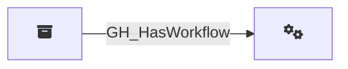

## Description

Represents a GitHub Actions workflow defined in a repository. Workflow nodes capture the workflow definition metadata including its file path, state, containing repository, and the full YAML contents of the workflow file. Only repositories with GitHub Actions enabled are queried for workflows.

## Edges

### Inbound Edges

| Start | End | Kind | Description |
|-------|-----|------|-------------|
| [GH_Repository](/opengraph/extensions/githound/reference/nodes/gh_repository) | [GH_Workflow](/opengraph/extensions/githound/reference/nodes/gh_workflow) | [GH_HasWorkflow](/opengraph/extensions/githound/reference/edges/gh_hasworkflow) | Repository contains workflow |

### Outbound Edges

No outgoing edges.

## Properties

::: openfetch_github.models.workflow.GHWorkflowProperties
    options:
      show_docstring_attributes: true
      inherited_members: true
      members_order: source
